# Bulk Delete #
**Contributors:** sudar  
**Tags:** mass, bulk, delete, post, comment, draft, revision, page, user, meta fields  
**Requires at least:** 3.9  
**Tested up to:** 4.9  
**Donate Link:** http://sudarmuthu.com/if-you-wanna-thank-me  
**Stable tag:** 5.5.7  
    

Bulk delete posts, pages, users, attachments and meta fields based on different conditions and filters.

## Description ##

Bulk Delete is a WordPress Plugin that allows you to delete posts, pages, attachments, users and meta fields in bulk based on different conditions and filters.

### Features

The following conditions and filters are supported.

#### Deleting posts

This Plugin supports the following bulk delete options for deleting posts

- Delete posts by category
- Delete posts by tag
- Delete posts by custom taxonomy
- Delete posts by custom post type
- Delete posts by url
- Delete posts by custom field (Available as a [Pro addon](http://bulkwp.com/addons/bulk-delete-posts-by-custom-field/?utm_source=wprepo&utm_campaign=BulkDelete&utm_medium=readme&utm_content=bd-cf))
- Delete posts by title (Available as a [Pro addon](http://bulkwp.com/addons/bulk-delete-posts-by-title/?utm_source=wprepo&utm_campaign=BulkDelete&utm_medium=readme&utm_content=bd-ti))
- Delete posts by duplicate title (Available as a [Pro addon](http://bulkwp.com/addons/bulk-delete-posts-by-duplicate-title/?utm_source=wprepo&utm_campaign=BulkDelete&utm_medium=readme&utm_content=bd-dti))
- Delete all draft posts
- Delete all pending posts
- Delete all private posts
- Delete all scheduled posts
- Delete all posts from trash (Available as a [Pro addon](http://bulkwp.com/addons/bulk-delete-from-trash/?utm_source=wprepo&utm_campaign=BulkDelete&utm_medium=readme&utm_content=bd-th))

All the above options support the following filters

- Post date greater than X days
- Post date less than X days
- Only public posts
- Only private posts
- Restrict to first N posts
- Delete permanently or just move to trash
- Schedule deletion of posts automatically (Available as a [Pro addon](http://bulkwp.com/addons/?utm_source=wprepo&utm_campaign=BulkDelete&utm_medium=readme&utm_content=pro))

#### Deleting posts by content

- Delete posts by content (Available as a [Pro addon](http://bulkwp.com/addons/bulk-delete-posts-by-content/?utm_source=wprepo&utm_campaign=BulkDelete&utm_medium=readme&utm_content=bd-p-co))
- Delete duplicate posts by title (Available as a [Pro addon](http://bulkwp.com/addons/bulk-delete-posts-by-duplicate-title/?utm_source=wprepo&utm_campaign=BulkDelete&utm_medium=readme&utm_content=bd-dti))
- Delete posts based on whether it contains attachment or not (Available as a [Pro addon](http://bulkwp.com/addons/bulk-delete-posts-by-attachment/?utm_source=wprepo&utm_campaign=BulkDelete&utm_medium=readme&utm_content=bd-p-at))

#### Deleting posts by user

- Delete posts by user role (Available as a [Pro addon](http://bulkwp.com/addons/bulk-delete-posts-by-user-role/?utm_source=wprepo&utm_campaign=BulkDelete&utm_medium=readme&utm_content=bd-ur))
- Delete posts by user (Available as a [Pro addon](http://bulkwp.com/addons/bulk-delete-posts-by-user/?utm_source=wprepo&utm_campaign=BulkDelete&utm_medium=readme&utm_content=bd-p-u))

#### Deleting pages

- Delete all published pages
- Delete all draft pages
- Delete all pending pages
- Delete all private pages
- Delete all scheduled pages
- Delete all pages from trash (Available as a [Pro addon](http://bulkwp.com/addons/bulk-delete-from-trash/?utm_source=wprepo&utm_campaign=BulkDelete&utm_medium=readme&utm_content=bd-th))

Like posts, all the above options support the following filters as well

- Post date greater than X days
- Post date less than X days
- Only public pages
- Only private pages
- Restrict to first N pages
- Delete permanently or just move to trash
- Schedule deletion of pages automatically (Available as a [Pro addon](http://bulkwp.com/addons/scheduler-for-deleting-pages-by-status/?utm_source=wprepo&utm_campaign=BulkDelete&utm_medium=readme&utm_content=bd-sp))

#### Deleting post revisions

- Delete all post revisions

#### Deleting users

- Delete users based on user role
- Delete users based on user meta fields
- Delete users who have not logged in in the last X days
- Delete users based on their registered date

#### Deleting Meta Fields

- Delete Post meta fields
- Delete Comment meta fields
- Delete User meta fields

#### Deleting Attachments

- Delete Attachments (Available as a [Pro addon](http://bulkwp.com/addons/bulk-delete-attachments/?utm_source=wprepo&utm_campaign=BulkDelete&utm_medium=readme&utm_content=bd-at))

#### Deleting other items
- Delete Jetpack Contact Form Messages

More options coming soon :)

As you can see, the Plugin provide comprehensive options and filters to perform bulk deletion.

If you looking for just moving posts, instead of deleting, then use [Bulk Move Plugin][2] instead.

### Pro Addons

The following are the popular pro addons that are available for purchase. The full list of [pro addons](http://bulkwp.com/addons/?utm_source=wprepo&utm_campaign=BulkDelete&utm_medium=readme&utm_content=pro) is available at the plugin site.

- **Delete posts by custom field** - Adds the ability to delete posts based on custom field. [More details](http://bulkwp.com/addons/bulk-delete-posts-by-custom-field/?utm_source=wprepo&utm_campaign=BulkDelete&utm_medium=readme&utm_content=bd-cf).
- **Delete posts by content** - Adds the ability to delete posts based on content. [More details](http://bulkwp.com/addons/bulk-delete-posts-by-content/?utm_source=wprepo&utm_campaign=BulkDelete&utm_medium=readme&utm_content=bd-p-co).
- **Delete posts by attachment** - Adds the ability to delete posts based on attachment [More details](http://bulkwp.com/addons/bulk-delete-posts-by-attachment/?utm_source=wprepo&utm_campaign=BulkDelete&utm_medium=readme&utm_content=bd-p-at).
- **Delete posts by title** - Adds the ability to delete posts based on title. [More details](http://bulkwp.com/addons/bulk-delete-posts-by-title/?utm_source=wprepo&utm_campaign=BulkDelete&utm_medium=readme&utm_content=bd-ti).
- **Delete posts by duplicate title** - Adds the ability to delete posts based on duplicate title. [More details](http://bulkwp.com/addons/bulk-delete-posts-by-duplicate-title/?utm_source=wprepo&utm_campaign=BulkDelete&utm_medium=readme&utm_content=bd-dti).
- **Delete posts by user role** - Adds the ability to delete posts based on user role. [More details](http://bulkwp.com/addons/bulk-delete-posts-by-user-role/?utm_source=wprepo&utm_campaign=BulkDelete&utm_medium=readme&utm_content=bd-ur).
- **Delete posts by user** - Adds the ability to delete posts based on user. [More details](http://bulkwp.com/addons/bulk-delete-posts-by-user/?utm_source=wprepo&utm_campaign=BulkDelete&utm_medium=readme&utm_content=bd-p-u).
- **Delete from trash** - Adds the ability to delete posts and pages from trash. [More details](http://bulkwp.com/addons/bulk-delete-from-trash/?utm_source=wprepo&utm_campaign=BulkDelete&utm_medium=readme&utm_content=bd-dh).
- **Scheduler Email** - Sends email whenever a Bulk WP Scheduler runs. [More details](http://bulkwp.com/addons/scheduler-email/?utm_source=wprepo&utm_campaign=BulkDelete&utm_medium=readme&utm_content=bd-se).
- **Scheduler for deleting posts Category** - Adds the ability to schedule auto delete of posts based on category. [More details](http://bulkwp.com/addons/scheduler-for-deleting-posts-by-category/?utm_source=wprepo&utm_campaign=BulkDelete&utm_medium=readme&utm_content=bd-sc).
- **Scheduler for deleting posts Tag** - Adds the ability to schedule auto delete of posts based on tag. [More details](http://bulkwp.com/addons/scheduler-for-deleting-posts-by-tag/?utm_source=wprepo&utm_campaign=BulkDelete&utm_medium=readme&utm_content=bd-st).
- **Scheduler for deleting posts by Custom Taxonomy** - Adds the ability to schedule auto delete of posts based on custom taxonomy. [More details](http://bulkwp.com/addons/scheduler-for-deleting-posts-by-taxonomy/?utm_source=wprepo&utm_campaign=BulkDelete&utm_medium=readme&utm_content=bd-stx).
- **Scheduler for deleting posts by Custom post type** - Adds the ability to schedule auto delete of posts based on custom post type. [More details](http://bulkwp.com/addons/scheduler-for-deleting-posts-by-post-type/?utm_source=wprepo&utm_campaign=BulkDelete&utm_medium=readme&utm_content=bd-cpt).
- **Scheduler for deleting posts by Post Status** - Adds the ability to schedule auto delete of posts based on post status like drafts, pending posts, scheduled posts etc. [More details](http://bulkwp.com/addons/scheduler-for-deleting-posts-by-status/?utm_source=wprepo&utm_campaign=BulkDelete&utm_medium=readme&utm_content=bd-sps).
- **Scheduler for deleting pages by status** - Adds the ability to schedule auto delete of pages based on status. [More details](http://bulkwp.com/addons/scheduler-for-deleting-pages-by-status/?utm_source=wprepo&utm_campaign=BulkDelete&utm_medium=readme&utm_content=bd-sp).
- **Scheduler for deleting users by User Role** - Adds the ability to schedule auto delete of users based on user role. [More details](http://bulkwp.com/addons/scheduler-for-deleting-users-by-role/?utm_source=wprepo&utm_campaign=BulkDelete&utm_medium=readme&utm_content=bd-u-ur).
- **Scheduler for deleting users by User Meta** - Adds the ability to schedule auto delete of users based on user meta. [More details](http://bulkwp.com/addons/scheduler-for-deleting-users-by-meta/?utm_source=wprepo&utm_campaign=BulkDelete&utm_medium=readme&utm_content=bds-u-ma).
- **Delete Post Meta Fields Pro** - Adds the ability to delete post meta fields based on value and to schedule automatic deletion. [More details](http://bulkwp.com/addons/bulk-delete-post-meta/?utm_source=wprepo&utm_campaign=BulkDelete&utm_medium=readme&utm_content=bd-m-p).
- **Delete Comment Meta Fields Pro** - Adds the ability to delete comment meta fields based on value and to schedule automatic deletion. [More details](http://bulkwp.com/addons/bulk-delete-comment-meta/?utm_source=wprepo&utm_campaign=BulkDelete&utm_medium=readme&utm_content=bd-m-c).
- **Delete User Meta Fields Pro** - Adds the ability to delete user meta fields based on value and to schedule automatic deletion. [More details](http://bulkwp.com/addons/bulk-delete-user-meta/?utm_source=wprepo&utm_campaign=BulkDelete&utm_medium=readme&utm_content=bd-m-u).
- **Delete attachment** - Adds the ability to delete attachments [More details](http://bulkwp.com/addons/bulk-delete-attachments/?utm_source=wprepo&utm_campaign=BulkDelete&utm_medium=readme&utm_content=bd-at).
- **Delete Jetpack Contact Form Messages Pro** - Adds the ability to delete Jetpack Contact Form Messages based on filters and to schedule automatic deletion. [More details](http://bulkwp.com/addons/bulk-delete-jetpack-contact-form-messages/?utm_source=wprepo&utm_campaign=BulkDelete&utm_medium=readme&utm_content=bd-jcm).

### Development

The development of the Plugin happens over at [github][6]. If you want to contribute to the Plugin, fork the [project at github][6] and send me a pull request.

If you are not familiar with either git or Github then refer to this [guide to see how fork and send pull request](http://sudarmuthu.com/blog/contributing-to-project-hosted-in-github).

If you are looking for ideas, then you can start with one of TODO items from the [issue tracker](7) :)

### Support

- If you have found a bug/issue or have a feature request, then post them in [github issues][7]
- If you have a question about the plugin usage or need help to troubleshoot, then post about it in our [BulkWP Support forums][1]
- If you have a question about any of the addon or need help to troubleshoot the addons, then post about it in our [BulkWP Support forums][1]
- If you like the Plugin, then kindly leave a review/feedback at [WordPress repo page][8]. This will help more people to discover the plugin.
- Checkout other [WordPress Plugins][5] that I have written
- If anything else, then contact us in [twitter][3].

 [1]: http://bulkwp.com/support
 [2]: http://sudarmuthu.com/wordpress/bulk-move
 [3]: http://twitter.com/bulkwp
 [5]: http://sudarmuthu.com/wordpress
 [6]: https://github.com/sudar/bulk-delete
 [7]: https://github.com/sudar/bulk-delete/issues
 [8]: http://wordpress.org/support/view/plugin-reviews/bulk-delete

## Translation ##

The Plugin currently has translations for the following languages.

*   Dutch (Thanks Rene)
*   Brazilian Portuguese (Thanks Marcelo of Criacao de Sites em Ribeirao Preto)
*   German (Thanks Jenny Beelens)
*   Turkish Portuguese (Thanks Bahadir Yildiz)
*   Spanish (Thanks Brian Flores)
*   Italian (Thanks Paolo Gabrielli)
*   Bulgarian (Thanks Nikolay Nikolov)
*   Russian (Thanks Maxim Pesteev)
*   Lithuanian (Thanks Vincent G)
*   Hindi (Thanks Love Chandel)
*   Serbian (Thanks Diana)
*   Gujarati (Thanks Puneet)

The pot file is available with the Plugin. If you are willing to do translation for the Plugin, use the pot file to create the .po files for your language and let me know.

## Credits ##

Thanks <a href="http://www.martincapodici.com">Martin Capodici</a> for providing the code to implement the "delete specific page" feature.

Thanks to [Time picker addon](http://trentrichardson.com/examples/timepicker/) JavaScript library, which the Plugin uses.

Thanks to [select2](https://select2.github.io/) JavaScript library, which the Plugin uses.

## Installation ##

The simplest way to install the plugin is to use the built-in automatic plugin installer. Go to plugins -> Add New and then enter the name of the plugin to automatically install it.

If for some reason the above method doesn't work then you can download the plugin as a zip file, extract it and then use your favorite FTP client and then upload the contents of the zip file to the wp-content/plugins/ directory of your WordPress installation and then activate the Plugin from Plugins page.

## Frequently Asked Questions ##

### After installing the Plugin, I just see a blank page. ###

This can happen if you have huge number of posts and your server is very underpowered. Check your PHP error log to see if there are any errors and correct them. The most common problems are script timeout or running out of memory. Change your PHP.ini file and increase the script timeout and/or amount of memory used by PHP process. You can view the current values of these settings from the system info page which can be accessed by going to Bulk WP -> System Info.

In particular try to change the following settings

*   `max_execution_time = 600` - Maximum execution time of each script, in seconds
*   `max_input_time = 30` - Maximum amount of time each script may spend parsing request data
*   `memory_limit = 256M` - Maximum amount of memory a script may consume

You can also try to disable different sections of the Plugin, if you have huge number of posts.

### How do I know what are the current values for these options configured in my server? ###

Access the System Info page using the menu Bulk WP -> System Info. The System info page displays the values for the different configuration options that are configured in your server.

### How do I disable different sections of the Plugin ###

You can enable or disable different sections of the Plugin by choosing the required modules in the screen option. You can open screen options by clicking the link in the top right corner of the Plugin page.

### Is it possible to restore the posts that I have deleted through the Plugin?  ###

If you choose the option "Move to trash" then you can find them from trash. But if you choose "Delete permanently", then it is not possible to retrieve the posts. So be **very careful**.

### Is it possible that some Plugin are not compatible with Bulk Delete? ###

Yes. If a Plugin rewrites the query vars by using `add_filter( 'pre_get_posts' )` then it may be incompatible with this Plugin.

If you find any Plugin with which Bulk Delete doesn't work, then let me know and I will try to see if I can add support through some hack.

### Is it possible to schedule deletion of posts? ###

The ability to schedule deletion of posts is available as a [pro addon](http://bulkwp.com/addons/?utm_source=wprepo&utm_campaign=BulkDelete&utm_medium=readme&utm_content=pro).

### I have a question about the pro addons, how should I contact you? ###

You can contact us by posting about it in our [support forum](http://bulkwp.com/support/?utm_source=wprepo&utm_campaign=BulkDelete&utm_medium=readme&utm_content=support).

## Screenshots ##

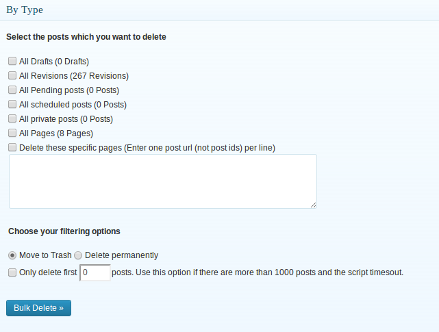

The above screenshot shows how you can delete posts by post status. You can choose to delete published posts, draft posts, pending posts, scheduled posts, private posts or sticky posts.

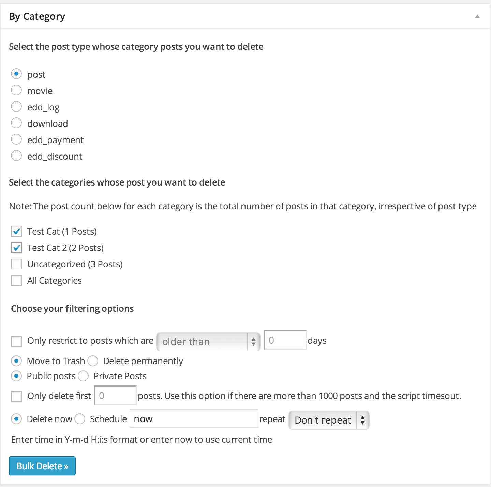

The above screenshot shows how you can delete posts by category. You can choose the post type from which you want to delete the posts.

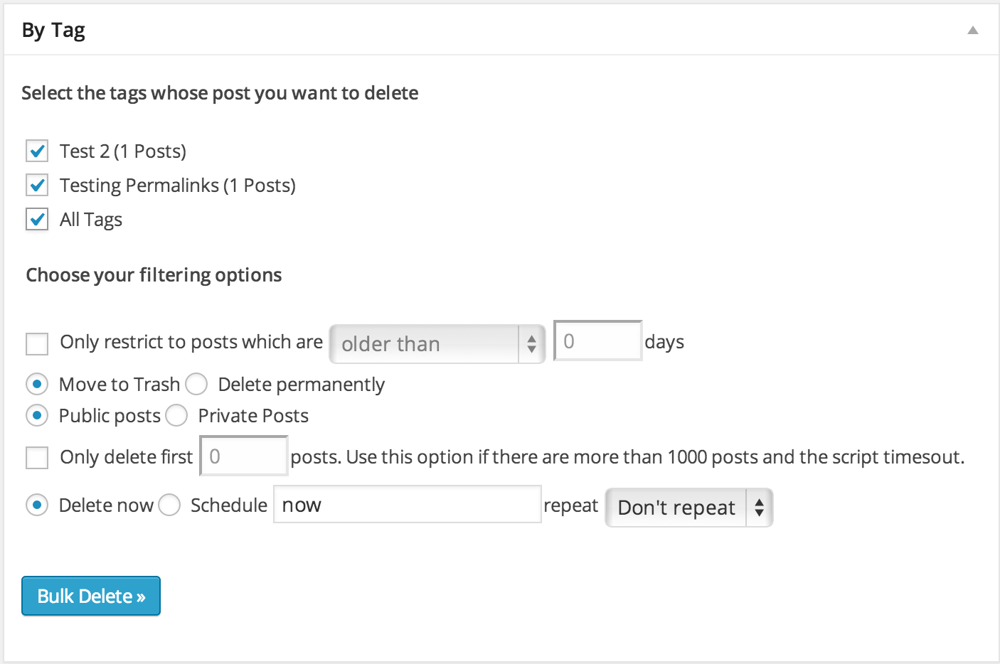

The above screenshot shows how you can delete posts by tag.

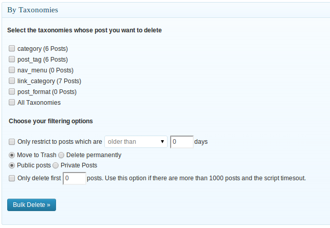

The above screenshot shows how you can delete posts by custom taxonomy. You can choose the post type, taxonomy name and the terms from which you want to delete the posts.

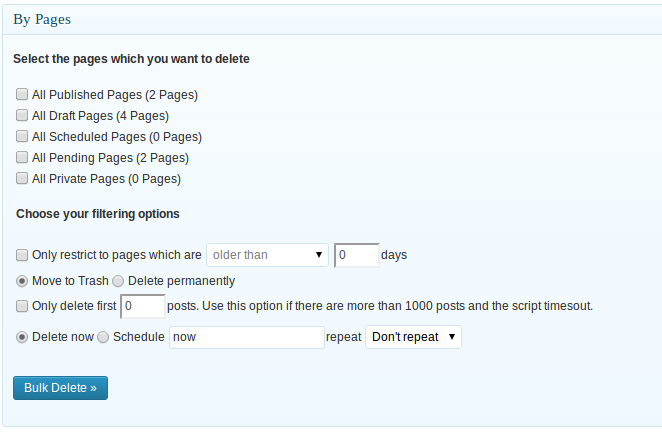

The above screenshot shows how you can delete posts by custom post type.

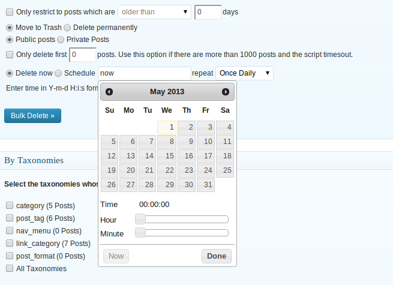

The above screenshot shows how you can delete pages by status. You can choose between published pages, draft pages, pending pages, scheduled pages and private pages.

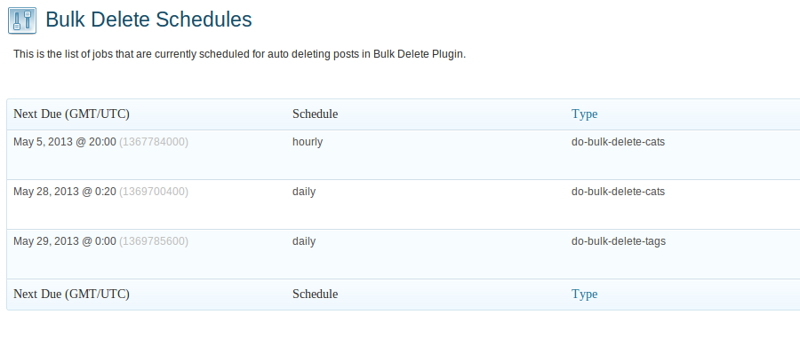

The above screenshot shows how you can delete users by user role. You can also filter by user's registered date or login date.

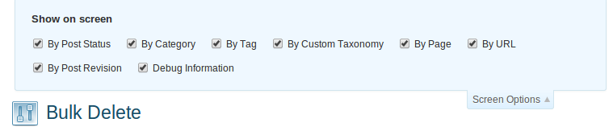

The above screenshot shows how you can delete users by user meta You can also filter by user's registered date or login date.

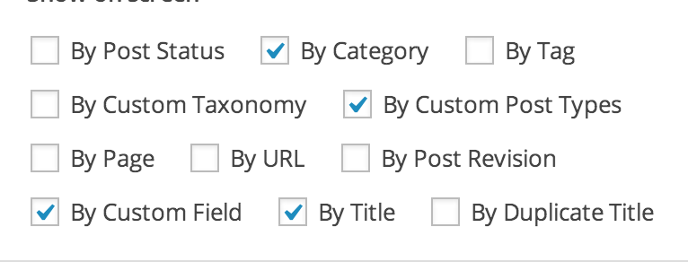

The above screenshot shows how you can enable/disable different sections in the delete posts page of the Plugin. Similarly you can enable different sections in the other pages of the plugin like delete posts, delete pages, delete users, delete meta fields and delete misc.

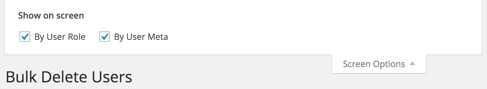

The above screenshot shows how you can enable/disable different sections in the delete users page of the Plugin.

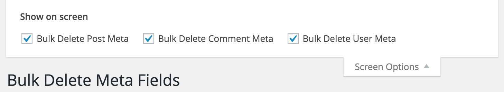

The above screenshot shows how you can enable/disable different sections in the delete meta fields page of the Plugin.

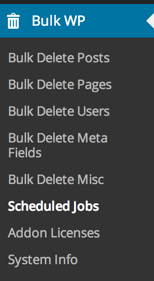

The above screenshot shows the different pages that are available in the plugin.

The above screenshot shows how you can schedule auto delete of posts. Note that this feature is available only when you buy [pro addons](http://bulkwp.com/addons/?utm_source=wprepo&utm_campaign=BulkDelete&utm_medium=readme&utm_content=pro).

## Readme Generator ##

This Readme file was generated using <a href = 'http://sudarmuthu.com/wordpress/wp-readme'>wp-readme</a>, which generates readme files for WordPress Plugins.
